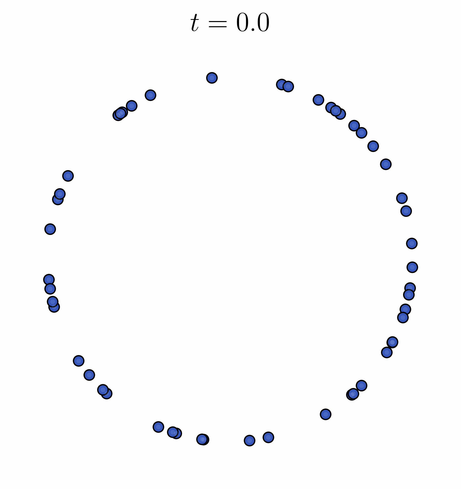
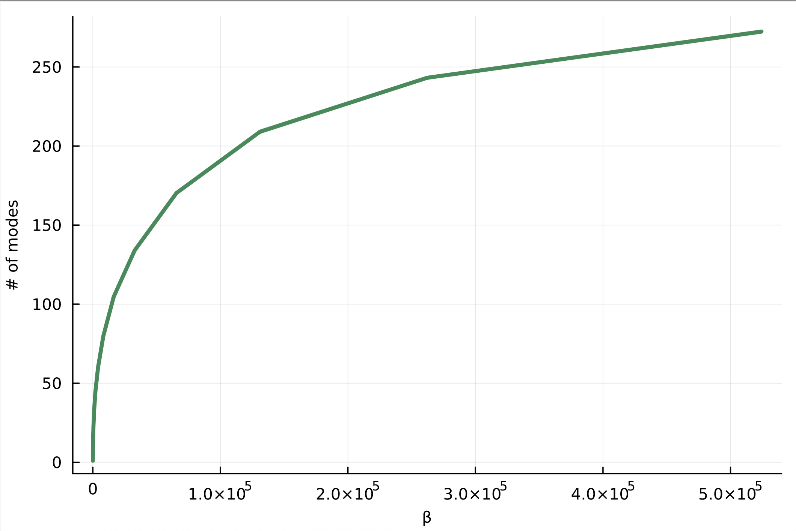

<!-- Title -->
<h1 align="center">
  On the number of modes of Gaussian kernel density estimators
</h1>

<p align="center">
  <a href="https://arxiv.org/2412.09080">
  
  </a>
</p>

<tt>Python</tt> codes for the paper 
**On the number of modes of Gaussian kernel density estimators** by Borjan Geshkovski, Philippe Rigollet, and Kimi Sun. 


<p align="center">
  
  
</p>


## Abstract

*We consider the Gaussian kernel density estimator with bandwidth $\beta^{-\frac12}$ of $n$ iid Gaussian samples. Using the Kac-Rice formula and an Edgeworth expansion, we prove that the expected number of modes on the real line scales as $\Theta(\sqrt{\beta\log\beta})$ as $\beta,n\to\infty$ provided $n^c\lesssim \beta\lesssim n^{2-c}$ for some constant $c>0$. An impetus behind this investigation is to determine the number of clusters to which Transformers are drawn in a metastable state.*

## Citing

```bibtex
@article{geshkovski2024number,
  title={On the number of modes of Gaussian kernel density estimators},
  author={Geshkovski, Borjan and Rigollet, Philippe and Sun, Yihang},
  journal={arXiv preprint arXiv:2412.09080},
  year={2024}
}
```
